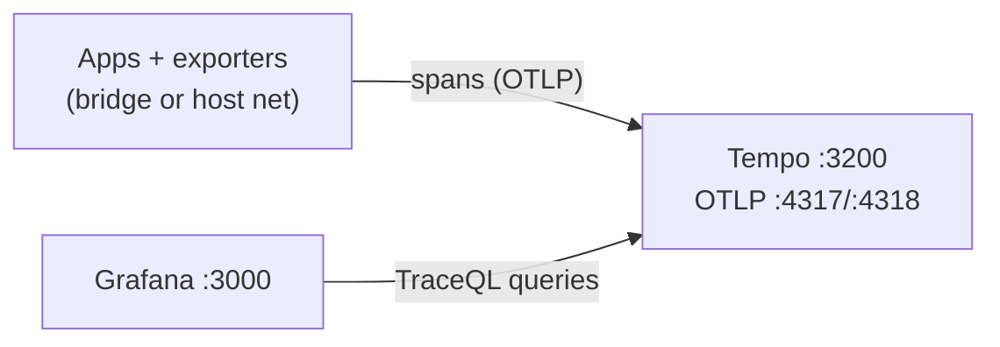

# Tempo — Architecture

> Distributed tracing backend of the observability triad: OTLP ingest only, TraceQL queries from Grafana. Metrics live in infra-prometheus, logs in infra-loki.

## Overview

A single-binary Tempo ([compose.yml](../compose.yml)) on the **host network**
— telemetry-tier convention — binding `0.0.0.0`: API `:3200`, OTLP gRPC
`:4317`, OTLP HTTP `:4318`. Any sibling can push traces regardless of its own
network mode; Grafana (also host-net) queries it over loopback. Traces persist
in a named volume (`tempo-data`) with 24h retention in dev.

## Data flow

- **OTLP is the only ingest path** — no Zipkin/Jaeger compatibility endpoints.
- Query path is HTTP JSON (`/api/search`, TraceQL) consumed by Grafana as
  datasource uid **`tempo`** at `http://localhost:3200`
  ([contract](../tempo/datasource-provisioning.yaml)).
- Dev storage is the local filesystem inside a volume; retention 24h.

## Instrumented edge path

The first traces to light up the pipeline come from the auth edge:
[infra-keycloak](https://github.com/sca-templates/infra-keycloak) login flows
and [infra-kong](https://github.com/sca-templates/infra-kong) gateway requests,
correlated by trace id across services.

## Configuration model

- [`tempo/tempo.yml`](../tempo/tempo.yml) pins ports and behavior once:
  standard OTLP ports, local backend, `block_retention: 24h`.
- No credentials anywhere: a tracing store holds nothing secret locally;
  production hardening (auth, TLS, object storage) is declared in
  [infra-kubernetes](https://github.com/sca-templates/infra-kubernetes).

## Production reference

Same single-binary shape per environment with object-storage backend,
rendered through the platform rollout; apps keep pushing OTLP unchanged.

## Related

- [README.md](../README.md) — commands, lifecycle and troubleshooting.
- Vault note: [04-infrastructure/tempo.md (sca-docs)](https://github.com/sca-templates/sca-docs/blob/main/04-infrastructure/tempo.md).
